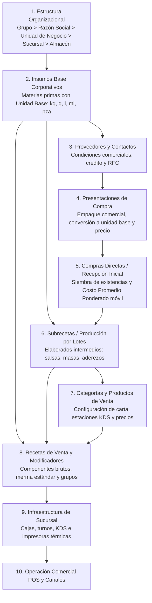
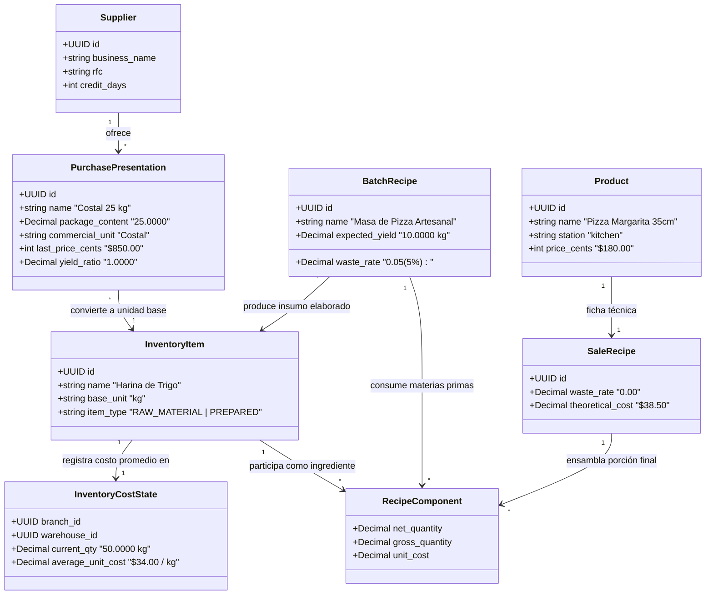
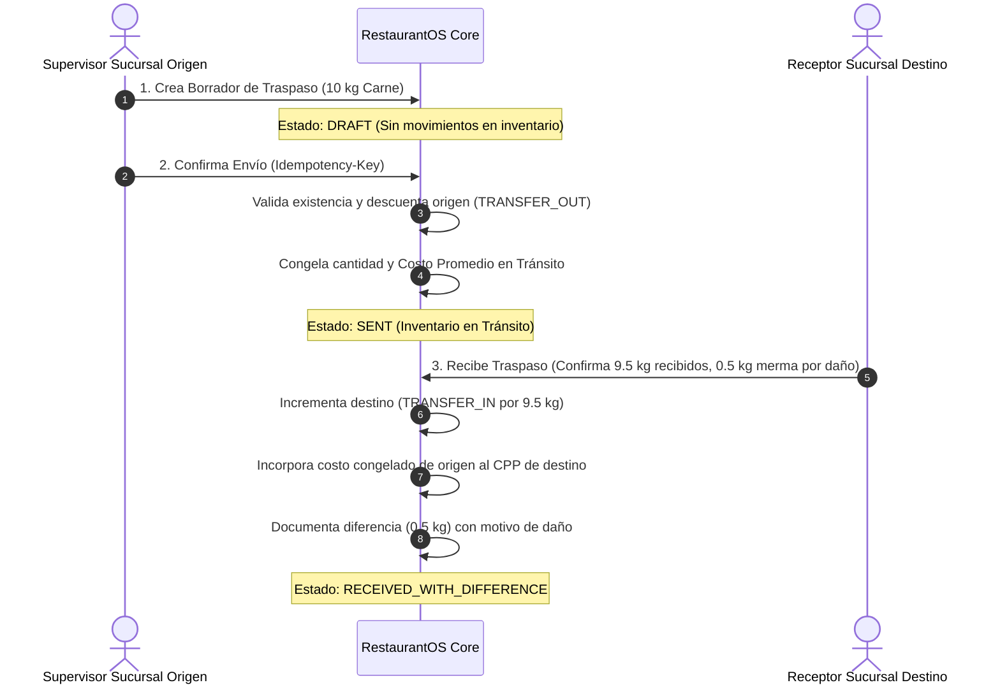
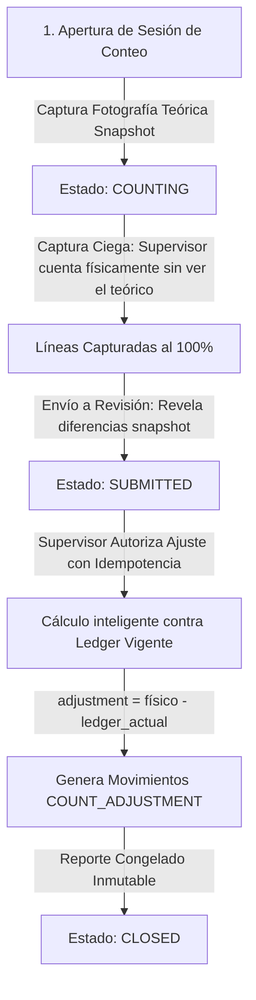
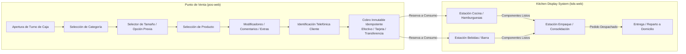

# RestaurantOS (Kiwi) — Manual Maestro, Especificación de Negocio y Blueprint Operativo

> **Versión del Documento:** 1.0.0  
> **Sistema:** RestaurantOS (Kiwi)  
> **Alcance:** Manual Integral de Usuario, Relaciones de Catálogo, Costeo Matemático, Operaciones de Inventario e Inteligencia Artificial en Back Office y POS.

---

## 1. Resumen Ejecutivo y Principios Fundamentales

**RestaurantOS** es una plataforma tecnológica integral, desacoplada y *offline-first*, diseñada para operar cadenas de comida rápida con cocinas locales por sucursal, altos volúmenes de venta y múltiples canales de captura (Punto de Venta físico, mostrador, servicio a domicilio, WhatsApp, Chatbot y Marketplaces como Uber Eats, DiDi Food y Rappi).

### 1.1 Invariantes de Oro y Principios de Dominio
1. **PostgreSQL es la fuente central de verdad; SQLite es la fuente operativa temporal**: Si la conexión a internet falla en una sucursal, el Gateway local (en Windows) permite a las cajas, impresoras y pantallas de cocina (KDS) seguir operando hasta por dos horas sin interrupciones. Al volver la conexión, los eventos se sincronizan mediante buzones *Outbox/Inbox* con claves de idempotencia.
2. **El inventario no se edita directamente; se deriva de un libro de movimientos (*Ledger*)**: No existe un campo "stock editable". Cada cambio en existencias proviene de una compra, un consumo de producción, una merma autorizada, un traspaso o un ajuste de conteo físico formal.
3. **Dinero exacto sin flotantes**: Todas las cifras monetarias se operan y almacenan en enteros de unidad mínima (centavos en MXN) o `Decimal` exacto en backend, garantizando cero descuadres contables por redondeo binario.
4. **Separación de comentarios e ingredientes adicionales**: Las instrucciones operativas (ej. *"Sin cebolla"*, *"Bien dorada"*) son comentarios táctiles que viajan a KDS y comanda sin afectar costo ni receta. Los ingredientes adicionales (ej. *"Tocineta extra"*, *"Queso extra"*) son artículos inventariables con precio de venta propio que descargan stock y costeo al confirmarse la preparación.
5. **Inmutabilidad transaccional y compensaciones**: Los pagos, ventas y recepciones confirmadas no se editan ni se eliminan; los errores se corrigen mediante contramovimientos y notas de compensación debidamente auditados.

---

## 2. Orden Canónico de Configuración Inicial (De Cero a la Venta)

Para que el sistema funcione de forma coherente, el catálogo debe crearse siguiendo una secuencia estricta de dependencias. No es posible crear una receta sin insumos, ni costear insumos sin presentaciones de compra o proveedores.



### Tabla de Etapas de Configuración

| Paso | Módulo | Entidad | Qué se define | Dependencia previa |
| :--- | :--- | :--- | :--- | :--- |
| **1** | Organización | `Organization`, `LegalEntity`, `BusinessUnit`, `Branch`, `Warehouse` | Grupo corporativo, razones sociales, sucursales (ej. Sucursal 01 Centro) y su único almacén operativo vinculado. | Ninguna |
| **2** | Inventarios | `InventoryItem` (Insumos Base) | Materias primas en unidad de medida base estandarizada (`kg`, `g`, `l`, `ml`, `pza`). SKU en dígitos ASCII. | Organización |
| **3** | Compras | `Supplier`, `SupplierContact` | Razón social de proveedor, RFC, plazo de crédito, días de entrega y contactos. | Organización |
| **4** | Compras | `PurchasePresentation` | Empaques comerciales del proveedor (ej. *Costal 25 kg*, *Caja 12 botellas 1L*), factor de conversión exacto a unidad base y precio de lista. | Insumo Base + Proveedor |
| **5** | Compras | `PurchaseDocument` | Recepción de compras para registrar entrada física de inventario (`PURCHASE_RECEIPT`) y fijar el primer Costo Promedio Ponderado. | Presentación de Compra + Almacén |
| **6** | Producción | `Recipe` (Tipo: *Production*) | Fórmulas de insumos elaborados por lote (ej. Salsa BBQ Casera, Masa de Pizza) con merma y rendimiento esperado. | Insumos Base + Existencia/Costo |
| **7** | Catálogo | `Category`, `Product` | Estructura del menú, productos vendibles, selectores previos (ej. Tamaño), estación KDS asignada (`kitchen`, `drinks`, `packing`). | Organización |
| **8** | Catálogo/Recetas | `Recipe` (Tipo: *Sale*), `ModifierGroup`, `ModifierOption` | Ficha técnica del platillo final, gramos/mililitros por porción, merma estándar, ingredientes adicionales y comentarios. | Insumos / Subrecetas + Productos |
| **9** | Sucursal/POS | `CashRegister`, `KdsStation`, `Printer` | Configuración física de terminales de cobro, pantallas de cocina y asignación de puertos de impresión térmica. | Sucursal |
| **10**| Punto de Venta | `CashShift` | Apertura de turno de caja con fondo inicial para comenzar la venta al público. | Caja + Usuario autenticado |

---

## 3. Relaciones entre Insumos, Presentaciones, Recetas, Productos y Costos

Entender la conexión entre lo que se compra al proveedor y lo que se sirve al cliente es el corazón del control de costos en RestaurantOS.



### 3.1 Niveles de la Cadena de Suministro y Conversión

1. **Unidad Base (`base_unit`)**: La unidad matemática indivisible en la que el almacén cuenta y las recetas calculan (`kg`, `g`, `l`, `ml`, `pza`). Todos los insumos tienen una sola unidad base.
2. **Presentación de Compra (`PurchasePresentation`)**: La forma en la que el proveedor vende el producto (ej. una cubeta de 19 L, una caja de 24 latas de 355 ml, un costal de 50 kg). Define el **factor de conversión**:
   $$\text{Contenido Aprovechable en Unidad Base} = \text{Contenido Bruto} \times \text{Rendimiento de Presentación}$$
   $$\text{Costo Unitario Equivalente Base} = \frac{\text{Precio Neto de Compra}}{\text{Contenido Aprovechable en Base}}$$
3. **Insumo Elaborado / Subreceta (`Batch Production`)**: Materia prima procesada internamente (ej. mayonesa de ajo, aderezo ranch, masa fermentada). Se produce por lotes; consume insumos base y genera un nuevo insumo inventariable con su propio costo promedio unitario.
4. **Producto de Venta (`Product`) y Receta de Venta (`Sale Recipe`)**: El platillo que se ofrece en el menú. Su receta explota los componentes (tanto materias primas directas como insumos elaborados) requeridos para 1 porción.

### 3.2 Fórmulas de Costeo Matemático

#### A. Costo Promedio Ponderado Móvil (CPP)
Cada vez que se confirma una recepción de compra en un almacén de sucursal, el costo promedio del insumo se recalcula instantáneamente:

$$\text{Nuevo Costo Promedio} = \frac{(\text{Existencia Anterior} \times \text{Costo Promedio Anterior}) + (\text{Cantidad Recibida} \times \text{Costo Unitario de Entrada})}{\text{Existencia Anterior} + \text{Cantidad Recibida}}$$

> [!IMPORTANT]
> - La edición de precios de lista o cotizaciones de proveedores **no** altera el costo promedio contable.
> - Solo la confirmación de una recepción física real de compra (`PURCHASE_RECEIPT`) o un traspaso entrante (`TRANSFER_IN`) recalcula el costo promedio.
> - Los impuestos (IVA) informativos y los fletes no integran el costo inventariable en este modelo base.

#### B. Merma Estándar en Recetas y Cantidad Bruta
Para costear platillos donde los ingredientes sufren merma natural durante el corte, pelado o cocción (ej. merma del 15% al pelar cebolla), el sistema calcula la cantidad bruta necesaria:

$$\text{Cantidad Bruta Requerida} = \frac{\text{Cantidad Neta Servida}}{1 - \text{Tasa de Merma Estándar}}$$
$$\text{Costo del Componente} = \text{Cantidad Bruta Requerida} \times \text{Costo Promedio Unitario}$$

---

## 4. Ejemplo Práctico Integral: De la Harina a la Hamburguesa Gourmet

A continuación se muestra un caso de estudio real con números exactos en pesos mexicanos (\$ MXN), ilustrando cómo viaja el costo a través de toda la cadena.

```
+-----------------------------------------------------------------------------------------------+
| PROVEEDOR "Distribuidora del Pacífico"                                                       |
| Vende: Bulto de Harina de Trigo 25 kg @ $450.00 MXN                                           |
| Costo Base Harina = $450.00 / 25 kg = $18.00 MXN / kg ($0.018 / g)                            |
+-----------------------------------------------------------------------------------------------+
                                                |
                                                v
+-----------------------------------------------------------------------------------------------+
| SUBRECETA POR LOTE (Producción interna en cocina): "Lote de 50 Panes Brioche"                 |
| - 3.500 kg Harina de Trigo ($18.00/kg)           = $63.00 MXN                                 |
| - 0.500 kg Mantequilla ($160.00/kg)              = $80.00 MXN                                 |
| - 10 pzas Huevo Fresco ($3.50/pza)               = $35.00 MXN                                 |
| - 0.400 L Leche Entera ($25.00/L)                = $10.00 MXN                                 |
| - 0.050 kg Levadura y Azúcar                     = $ 7.00 MXN                                 |
| Total Costo del Lote = $195.00 MXN                                                            |
| Rendimiento Real = 50 bollos terminados                                                       |
| Costo Unitario Insumo Elaborado "Pan Brioche" = $195.00 / 50 = $3.90 MXN / pieza              |
+-----------------------------------------------------------------------------------------------+
                                                |
                                                v
+-----------------------------------------------------------------------------------------------+
| RECETA DE VENTA: "Hamburguesa Gourmet Doble Carne" (Precio de Venta POS: $149.00 MXN)         |
| 1. Pan Brioche Artesanal: 1 pza @ $3.90/pza                         = $ 3.90 MXN              |
| 2. Carne Molida Sirloin: 200 g netos (Merma 10% -> 222.2 g @ $140/kg) = $31.11 MXN             |
| 3. Queso Cheddar Americano: 2 rebanadas (40 g @ $180/kg)            = $ 7.20 MXN              |
| 4. Tocino Ahumado: 30 g netos (Merma 20% -> 37.5 g @ $220/kg)       = $ 8.25 MXN              |
| 5. Aderezo Secreto BBQ: 30 ml (Subreceta elaborada @ $0.08/ml)      = $ 2.40 MXN              |
| 6. Vegetales (Lechuga, Tomate, Cebolla): Porción estándar           = $ 3.50 MXN              |
| 7. Empaque y Papel Grado Alimenticio: 1 kit                         = $ 2.80 MXN              |
| TOTAL COSTO TEÓRICO DE PRODUCCIÓN POR HAMBURGUESA                   = $59.16 MXN              |
+-----------------------------------------------------------------------------------------------+
                                                |
                                                v
+-----------------------------------------------------------------------------------------------+
| ANÁLISIS DE RENTABILIDAD Y MARGEN (Food Cost)                                                 |
| - Precio de Venta al Público:   $149.00 MXN                                                   |
| - Costo de Alimentos (Insumos): $ 59.16 MXN                                                   |
| - Margen de Contribución Bruto: $ 89.84 MXN (60.30%)                                          |
| - % Costo de Alimento (% FC):   39.70%                                                        |
+-----------------------------------------------------------------------------------------------+
```

---

## 5. Operaciones Avanzadas de Inventario

RestaurantOS implementa un modelo de control de inventarios de grado industrial, garantizando trazabilidad absoluta mediante su libro de movimientos (`ledger`).

### 5.1 Producción por Lotes (Batch Production)
Para aderezos, masas, salsas, marinados y cárnicos porcionados:
1. **Orden de Producción**: El encargado selecciona la receta de producción (ej. *Aderezo Chipotle 5 Litros*).
2. **Explosión y Descarga (`PRODUCTION_INPUT`)**: Al confirmar la orden, el sistema descuenta automáticamente del almacén las materias primas utilizadas (mayonesa, chipotle en lata, especias, aceite).
3. **Alta del Insumo Elaborado (`PRODUCTION_OUTPUT`)**: Se ingresa la cantidad neta obtenida (5 L).
4. **Cálculo del Costo Real del Lote**: Si se gastaron \$150.00 en insumos y se obtuvieron 4.8 L reales (por residuo en licuadora), el nuevo costo promedio unitario del elaborado se calcula con el rendimiento real:
   $$\text{Costo Unitario} = \frac{\$150.00}{4.8\text{ L}} = \$31.25\text{ por Litro}$$
5. **Venta Posterior**: Cuando el cajero vende una hamburguesa con salsa chipotle, el sistema descarga mililitros de salsa chipotle; **no** vuelve a explotar mayonesa ni chipotles en lata.

### 5.2 Traspasos entre Sucursales (Transfers)
Gestiona el traslado seguro de materias primas e insumos elaborados entre sucursales:



- **Invariante**: No existe recepción mágica ni automática. El destino debe contar físicamente e ingresar lo que realmente llegó.
- **Costeo**: El destino absorbe los insumos al costo promedio que tenían en el origen al momento de despacharse, sin tratarse como una compra a proveedor.

### 5.3 Mermas Reales (Waste Management)
Distingue con precisión quirúrgica entre tres tipos de pérdidas:
1. **Merma Estándar de Receta**: Pérdida natural presupuestada en la ficha técnica (cáscaras, evaporación).
2. **Merma Real Extraordinaria (`WASTE_REAL`)**: Caducidad de insumos, producto caído al suelo, corte de refrigeración o quemado en parrilla.
   - Captura en borrador (`draft`) $\rightarrow$ Autorización de supervisor (`confirmed`).
   - Requiere permiso `inventory.waste`, existencia suficiente e idempotencia.
   - Genera una salida valorizada al costo promedio ponderado vigente.
   - **Reversión (`WASTE_REVERSAL`)**: Si hubo error de captura, nunca se borra la fila original; se crea un contramovimiento positivo auditado que restituye el stock.
3. **Cancelaciones Post-Producción**: Platillo que ya se cocinó pero el cliente canceló la orden. Se registra como merma de producto terminado, impidiendo que el insumo regrese a stock crudo.

### 5.4 Conteos Físicos y Conciliación Ciega (Auditorías de Inventario)
Garantiza que las auditorías de inventario no detengan la operación ni se vean corrompidas por ventas en curso:



- **Captura Ciega**: El auditor o encargado de cocina ingresa las cantidades contadas sin que la pantalla le revele cuánto "debería haber". Esto elimina el sesgo de confirmación.
- **Protección contra Desfase Temporal**: Si la fotografía se tomó a las 08:00 AM (teórico: 20 kg) y el conteo se aprueba a las 09:30 AM (se contaron 18 kg), pero a las 08:45 AM hubo una venta legítima de 1 kg en caja (quedando 19 kg en ledger actual):
  - El ajuste aplicado no es $-2\text{ kg}$; el sistema aplica:
    $$\text{Ajuste} = \text{Conteo Físico (18 kg)} - \text{Ledger Actual (19 kg)} = -1\text{ kg}$$
  - De este modo, **jamás se sobreescriben ni se pierden las ventas o compras intermedias**.

---

## 6. El Flujo de Ventas en el POS y KDS



1. **Selector Previo de Categoría (`Category Option First`)**: Para categorías con múltiples presentaciones (ej. Pizzas o Bebidas), la interfaz solicita primero el **Tamaño** (Chica, Mediana, Familiar) antes de mostrar los productos concretos, agilizando la selección táctil y previniendo errores.
2. **Identificación Telefónica en Checkout**: El cajero teclea el número telefónico a 10 dígitos. El sistema busca clientes existentes de forma instantánea. Si el cliente no existe, permite crearlo con nombre y dirección en el mismo modal sin perder el carrito ni reiniciar la venta.
3. **Gestión de Domicilios y Repartidores**: Para pedidos `delivery`, se selecciona una dirección estructurada del cliente y se asigna un repartidor activo de la sucursal.
4. **Cobro Idempotente y Cajas**: Se capturan los importes exactos en efectivo, tarjeta de débito, crédito o transferencia. Confirmar el pago es una operación atómica: genera el folio fiscal/comercial, envía la comanda a la impresora térmica y despacha las tareas a las pantallas de cocina correspondientes.

---

## 7. El Papel de la Inteligencia Artificial en RestaurantOS

RestaurantOS integra capacidades de Inteligencia Artificial avanzadas y seguras, diseñadas bajo el principio de **cero alucinaciones, estricta privacidad de datos y supervisión humana obligatoria (*Human-in-the-Loop*)**.

```mermaid
flowchart TD
    subgraph BACKOFFICE["Back Office (Admin AI - AIA-001/002)"]
        Q[Consulta / Petición del Administrador] --> AI_ENG[Motor de IA Administrativo]
        AI_ENG --> DIAG[Diagnóstico Determinista Canónico\nEj. Insumos sin precio de compra / sin costo]
        AI_ENG --> PROP[Propuesta Estructurada DRAFT\nJSON Schema Estricto + Fingerprint]
        PROP --> REV[Revisión Humana en UI de Catálogo]
        REV -->|Aceptar con Idempotencia| APP[Ejecución en Servicio Canónico de Dominio]
        REV -->|Rechazar o Expirar| CANC[Sin Cambios en Base de Datos]
    end

    subgraph FRONTOFHOUSE["Front of House / POS (Pedido Asistido por Voz)"]
        VOICE[Dictado por Voz / Texto del Cajero] --> REDACT[Sanitización y Redacción PII\nOculta Nombre y Teléfono]
        REDACT --> PARSER[Intérprete LLM de Menú]
        PARSER --> RESOLV[Resolución contra Catálogo Canónico]
        RESOLV -->|Faltan Opciones Obligatorias| ASK[Pregunta Interactiva de Opciones]
        RESOLV -->|Borrador Completo| CART[Llenado Seguro del Carrito en POS]
        CART --> CASHIER[Cajero Revisa y Confirma Cobro]
    end
```



### 7.1 IA en el Back Office (Administración Corporativa)
El asistente administrativo (`AdminAiService`) actúa como un copiloto de gestión y configuración de catálogos:
- **Diagnósticos Canónicos de Alta Precisión**:
  - Si el usuario pregunta *"¿Qué insumos no tienen precio?"*, el sistema no inventa datos; identifica la ambigüedad y solicita aclarar si se refiere a **Precio de Compra de Proveedor** o **Costo Promedio Ponderado por Sucursal**.
  - Ejecuta consultas deterministas en la base de datos para listar exactamente los SKU faltantes y ofrecer enlaces directos para completarlos.
- **Ciclo de Propuestas Seguras (`DRAFT` $\rightarrow$ `READY_FOR_REVIEW` $\rightarrow$ `APPLIED`)**:
  - La IA **nunca** tiene permisos de escritura directa ni ejecuta `INSERT/UPDATE` en la base de datos.
  - Cuando se le solicita crear un producto, insumo o receta, la IA genera una propuesta estructurada (`JSON`) con un *fingerprint* de contexto.
  - El administrador revisa visualmente la comparativa (*Actual vs. Propuesto*). Al hacer clic en "Aceptar", es el backend de RestaurantOS quien ejecuta la mutación validando permisos y unicidad.
- **Seguridad y Privacidad Estricta**: La IA de back office tiene un contexto *Allowlist*: nunca se le envían nombres de clientes, datos de empleados, ventas monetarias, saldos de caja ni auditorías confidenciales.

### 7.2 IA en el Front of House / Punto de Venta (Captura Asistida de Pedidos)
Agiliza la toma de pedidos telefónicos o en mostrador mediante lenguaje natural y reconocimiento de voz:
- **Dictado por Voz en Navegador (Web Speech API)**: El cajero pulsa el botón de micrófono y escucha al cliente (ej. *"Buenas tardes, quiero una Baguette BBQ sin cebolla y unas papas gajo para recoger a nombre de Miguel González teléfono 6672013019"*).
- **Sanitización y Redacción Previa de PII**: El cliente web extrae el teléfono y nombre localmente antes de consultar al modelo de IA, enviando identificadores anónimos para proteger la privacidad del cliente.
- **Mapeo Inteligente a Catálogo Canónico**:
  - Resuelve "Baguette BBQ" $\rightarrow$ `product_id: ...`
  - Resuelve "sin cebolla" $\rightarrow$ Comentario preestablecido vinculado.
  - Identifica el tipo de servicio $\rightarrow$ `takeout`.
  - Busca al cliente por teléfono y lo preselecciona en caja.
- **Cierre Defensivo ante Opciones Pendientes**: Si el cliente pidió una bebida pero no indicó el tamaño, el asistente no inventa; despliega inmediatamente las opciones interactivas en pantalla para que el cajero seleccione la elección antes de añadirla al carrito.
- **Control Humano Total**: El asistente solo llena el carrito como borrador. El cajero conserva el control total para editar, cobrar e imprimir la comanda.

---

## 8. Guía de Referencia Rápida: Matrices y Tablas Operativas

### 8.1 Matriz de Permisos por Rol

| Permiso de Dominio | Administrador Corporativo | Supervisor de Sucursal | Cajero | Encargado de Inventarios | Auditor |
| :--- | :---: | :---: | :---: | :---: | :---: |
| `admin.manage` (Catálogo Central, Sucursales, Roles) | :white_check_mark: | :x: | :x: | :x: | :x: |
| `branch.admin.access` (Administración de Sucursal) | :white_check_mark: | :white_check_mark: | :x: | :x: | :x: |
| `catalog.branch.manage` (Disponibilidad y Excepciones) | :white_check_mark: | :white_check_mark: | :x: | :x: | :x: |
| `pos.operate` / `orders.create` (Venta en POS) | :white_check_mark: | :white_check_mark: | :white_check_mark: | :x: | :x: |
| `cash.shift.open` / `cash.shift.close` (Caja y Turnos) | :white_check_mark: | :white_check_mark: | :white_check_mark: | :x: | :x: |
| `payments.confirm` (Cobro de Pedidos) | :white_check_mark: | :white_check_mark: | :white_check_mark: | :x: | :x: |
| `purchases.manage` / `purchases.create` (Compras) | :white_check_mark: | :white_check_mark: | :x: | :white_check_mark: | :x: |
| `production.manage` (Lotes de Producción) | :white_check_mark: | :white_check_mark: | :x: | :white_check_mark: | :x: |
| `inventory.transfer.send` (Envío de Traspasos) | :white_check_mark: | :white_check_mark: | :x: | :white_check_mark: | :x: |
| `inventory.transfer.receive` (Recepción de Traspasos) | :white_check_mark: | :white_check_mark: | :x: | :white_check_mark: | :x: |
| `inventory.waste` (Registro de Mermas Reales) | :white_check_mark: | :white_check_mark: | :x: | :white_check_mark: | :x: |
| `inventory.count` (Aprobación de Conteo Físico) | :white_check_mark: | :white_check_mark: | :x: | :white_check_mark: | :x: |
| `inventory.read` / `audit.read` (Consultas y Auditoría) | :white_check_mark: | :white_check_mark: | :x: | :white_check_mark: | :white_check_mark: |

### 8.2 Tipos de Movimientos de Inventario (`InventoryMovementType`)

| Código de Movimiento | Naturaleza | Afectación Stock | Afecta Costo Promedio (CPP) | Documento de Origen |
| :--- | :--- | :---: | :---: | :--- |
| `PURCHASE_RECEIPT` | Entrada por Compra | $+$ | **Sí** (Recalcula promedio móvil) | `PurchaseDocument` |
| `PURCHASE_REVERSAL`| Reversa de Compra Cancelada | $-$ | Restaura CPP anterior | `PurchaseDocument` |
| `PRODUCTION_INPUT` | Consumo de Materias Primas | $-$ | No (usa CPP vigente) | `ProductionBatch` |
| `PRODUCTION_OUTPUT`| Entrada de Insumo Elaborado | $+$ | **Sí** (Costo real del lote / rendimiento) | `ProductionBatch` |
| `CONSUMPTION` | Consumo por Venta (KDS) | $-$ | No (usa CPP vigente) | `Order` / `OrderLineConsumption` |
| `TRANSFER_OUT` | Salida por Traspaso a otra sucursal | $-$ | No (congela costo en tránsito) | `InventoryTransfer` |
| `TRANSFER_IN` | Entrada por Traspaso recibido | $+$ | **Sí** (Incorpora CPP congelado) | `InventoryTransfer` |
| `WASTE_REAL` | Merma Real Extraordinaria | $-$ | No (usa CPP vigente) | `WasteRecord` |
| `WASTE_REVERSAL` | Corrección de Merma | $+$ | Restaura existencia sin alterar CPP | `WasteRecord` |
| `COUNT_ADJUSTMENT` | Ajuste por Conteo Físico | $+/-$ | No (usa CPP vigente) | `PhysicalCountSession` |

---

## 9. Glosario de Términos Operativos

- **Costo Promedio Ponderado (CPP)**: Método de valuación de inventario que promedia el costo unitario de las existencias actuales con el costo de cada nueva compra confirmada.
- **Costo Teórico**: El costo presupuestado de un platillo sumando los costos promedio de cada uno de sus ingredientes brutos según la ficha técnica.
- **Merma Estándar**: Porcentaje previsible de pérdida física que sufre un ingrediente durante su manipulación o cocción.
- **Merma Real**: Pérdida involuntaria e imprevista de insumos o productos por daño, caducidad, error de cocina o accidente.
- **Insumo Base**: Materia prima comprada al proveedor que no ha sufrido transformación en cocina (ej. Harina, Queso, Jitomate).
- **Insumo Elaborado / Subreceta**: Producto intermedio cocinado por lote en sucursal que se almacena para su uso en platillos finales (ej. Salsa de Pizza, Carne Marinada).
- **KDS (Kitchen Display System)**: Pantallas digitales en cocina que sustituyen comandas de papel y coordinan las estaciones de preparación en tiempo real.
- **Fotografía Teórica (Snapshot)**: Congelamiento de las existencias y costos en el sistema al momento exacto de iniciar una sesión de conteo físico.
- **Ledger de Inventarios**: Libro mayor transaccional donde cada movimiento es un registro inmutable; el saldo físico actual es la suma de todos los movimientos históricos.
- **Idempotencia (`Idempotency-Key`)**: Mecanismo de seguridad informática que garantiza que si una petición de cobro, compra o traspaso se envía dos veces por error de red, el sistema solo procese la acción una sola vez sin duplicar cargos ni movimientos.

---
*Manual generado para RestaurantOS (Kiwi). Documento canónico para consulta operativa, arquitectura técnica e integración de interfaz web.*
