# POS-CAJERO-001 — Diagnóstico y propuesta para caja

Fecha: 2026-10-01. Base inspeccionada: `main`, commit `aa28b32`.
Estado: propuesta para revisión; no autoriza ni implementa cambios de runtime.
Riesgo de este paquete: R0, documentación y evidencia. Una implementación que toque cobro,
inventario, permisos, recuperación u offline será R3.

## Alcance y método

Reducir fricción para un cajero acostumbrado a Soft Restaurant, conservando la identidad
minimalista de Kiwi. Sólo recoger en caja y domicilio; sin mesas.

Se recorrió el frontend actual contra la API real del repositorio en localhost, con la fixture
canónica de `tests/e2e/admin_retro_fixture.py`, una base SQLite temporal y un usuario sintético
con el rol **Cajero**, asignado a Sucursal Piloto y Caja 1 con turno abierto. Capturas de Kiwi
a 1366 × 768. No se usaron datos, credenciales, servicios de impresión ni servidores productivos.
No es una certificación de producción, PostgreSQL, hardware de caja ni operación offline.

Se consultaron ambos videos mediante reproducción y transcripciones automáticas. Las capturas
de pantalla prevalecen sobre errores de transcripción. Las referencias son históricas:

- [Servicio Rápido, versión 10](https://www.youtube.com/watch?v=Yqfn2Wuv2Co): grupos, cantidades,
  comentarios, pago y cuenta en espera. La captura muestra SR 10.004.
- [Servicio a domicilio](https://www.youtube.com/watch?v=LNtg70gaKD0): la interfaz muestra
  **Soft Restaurant Pro 9.5.0**, no versión 10. Alta de cliente/domicilio, repartidor, impresión
  y cobro al regresar el repartidor.

No se extrapolan esos comportamientos a versiones actuales. Los videos no permiten certificar
sus permisos, integridad transaccional, reservas, reintentos, modificadores obligatorios ni tarifa
de envío. Para comparar con el sistema instalado del cliente falta su versión/configuración y
una grabación de ambos recorridos, incluyendo espera, cancelación, cambio y comanda de cocina.

## Resultado principal

Kiwi ya conserva cuenta y total en una columna derecha, usa tarjetas claras y comparte con el
tutorial los cinco grupos Todo/Alimentos/Bebidas/Otros/Favoritos. Conviene conservar esa base.

Los mayores problemas son operativos: **guardar un pendiente ya acepta el pedido y crea tareas
KDS**; no equivale a suspender un borrador. El listado llama **Preparando** a un pedido recién
aceptado, sin mostrar allí que falta cobrar. El domicilio se conserva, pero la proyección del
detalle no lo presenta. Salir del POS descarta un carrito todavía sin confirmar. Cobrar no
equivale a entregar: ambos pagos probados dejaron la orden en `ACCEPTED`.

## Recorrido real 1: recoger en caja

Se utilizó el modo existente **Para llevar** (`takeout`). Inicio con caja configurada y abierta.
Una acción significa un clic o la captura completa de un campo; no cada tecla. Se cuenta aceptar
la alerta de éxito; no login, apertura de turno, espera de red ni scroll.

1. **Elegir Para llevar** — 1 acción. Funciona, pero convive con En sucursal, que cobra de otra
   manera. [E03](POS-CAJERO-001-assets/03-cajero-inicio.jpg).
2. **Comida → Hamburguesa Kiwi → sumar una unidad** — 3 acciones. Dos unidades, $190.
   Cantidad y total visibles; no entrada numérica directa. [E04](POS-CAJERO-001-assets/04-recoger-carrito-cajero.jpg).
3. **Guardar pedido pendiente → nombre → Efectivo → Guardar pendiente → cerrar alerta** —
   5 acciones. Se elige un método previsto; no se confirma pago. El modal se titula Cobrar pedido,
   lo que contradice la acción final. [E05](POS-CAJERO-001-assets/05-recoger-confirmar-pendiente.jpg).
4. **Pedidos → seleccionar folio** — 2 acciones. `PILOTO-000001`, `ACCEPTED`, sin pago y tareas
   pendientes. El listado muestra Preparando. [E06](POS-CAJERO-001-assets/06-recoger-pedido-aceptado-sin-pago.jpg).
5. **Confirmar pagado** — 1 acción con efectivo previsto ya seleccionado. Se registra el total
   exacto. Sin campo de recibido, cálculo de cambio ni pantalla previa que resuma esa operación.
   No cambia el estado de producción/entrega. [E08](POS-CAJERO-001-assets/08-recoger-pago-confirmado.jpg).
6. **Registrar entrega** — bloqueado en esta vista/rol: no hay control de entrega; Cajero no tiene
   `orders.fulfill`. No se presenta como un recorrido completado hasta entrega.

Referencia de acciones hasta pago: **12**, para ese pedido de dos unidades y nombre manual.
También se probó editar antes de cobrar: Editar → sumar → Guardar cambios → confirmar cambios
sin pago → cerrar alerta → seleccionar de nuevo → cobrar. Recorrido con esa edición: **18**
acciones. Se mantuvo un único folio, versión 2 y total $285. La tarea anterior quedó CANCELLED
y una nueva quedó PENDING; no son dos comandas activas. [E07](POS-CAJERO-001-assets/07-recoger-edicion.jpg).

## Recorrido real 2: domicilio

1. **A domicilio → Comida → Papas → Cliente** — 4 acciones desde POS inicial. El cliente puede
   capturarse dentro de la venta. No se obliga a asignar repartidor.
2. **Teléfono de diez dígitos → nombre → Registrar y seleccionar cliente** — 3 acciones.
   La búsqueda se dispara al completar el teléfono. Alta sin salir de caja; el formulario también
   permite correo opcional. [E09](POS-CAJERO-001-assets/09-domicilio-alta-cliente.jpg).
3. **Alta de domicilio** — 8 campos obligatorios: alias, calle, exterior, colonia, CP, ciudad,
   municipio y estado. Se capturaron además referencias e instrucciones y se pulsó Guardar
   domicilio: **11 acciones**. La dirección queda seleccionada automáticamente. El modal largo
   exige desplazarse y tapa la cuenta; no se propone suprimir campos requeridos.
4. **Efectivo previsto → Guardar pendiente → cerrar alerta** — 3 acciones. Total $45;
   `PILOTO-000002`, `ACCEPTED`, sin pago confirmado al crearlo.
   [E10](POS-CAJERO-001-assets/10-domicilio-confirmar-pendiente.jpg).
5. **Pedidos → seleccionar folio → Confirmar pagado** — 3 acciones. El listado vuelve a mostrar
   Preparando. Teléfono/dirección/referencias no aparecen en el detalle probado, aunque sí están
   en los snapshots de la API. [E11](POS-CAJERO-001-assets/11-domicilio-pedido-pendiente.jpg).
6. **Salida a reparto / entrega** — sin controles en esta vista y sin permiso `orders.fulfill`
   para Cajero. Cobro probado sólo con datos ficticios: un pago por $45, estado `ACCEPTED`.
   [E12](POS-CAJERO-001-assets/12-domicilio-pago-confirmado.jpg).

Referencia reproducible desde POS inicial hasta pago: **24 acciones** con cliente nuevo y las
dos notas opcionales; **22** omitiendo esas notas. Es un conteo de interacción, no de tiempo.
Desde una categoría ya abierta se resta una acción. No se midió un recorrido completo hasta
entrega porque la interfaz no permite cerrarlo con este rol.

## Matriz de diferencias

Prioridad P1: riesgo de error, pérdida o bloqueo del trabajo de caja; P2: rapidez/claridad.
N/V: no verificable en los videos. Los conteos de Kiwi son locales por operación y no deben
sumarse indiscriminadamente. No se inventa un conteo de clics de Soft Restaurant a partir de
una demostración narrada con cambios de pantalla. Las metas son estimaciones del diseño.

| Punto | Evidencia histórica de Soft Restaurant | Kiwi comprobado | Acciones Kiwi actuales / meta propuesta | Prioridad y cambio |
|---|---|---|---|---|
| 1. Inicio y servicio | Rápido y domicilio son accesos separados; domicilio abre cuenta y cliente. SR10 1:27–2:00; PRO9.5 0:51–1:19. | Tres opciones: En sucursal, Para llevar y A domicilio; inicial En sucursal. E03; POS:206,346. | Elegir modo: 1 / 1. Flujo hasta pago: 12 recoger, 24 domicilio nuevo; no comparar esos totales con clics SR N/V. | P1. Dos destinos visibles, conservando explícitamente las dos modalidades actuales de cobro de recoger. |
| 2. Catálogo, repetición y cantidades | SR10 presenta cinco grupos, categorías/productos y +/−/teclado de cantidad; 2:00–2:38, 4:07–4:36. | Mismos cinco grupos. Categoría → producto: 2. Búsqueda escrita desde inicio deja categorías visibles; filtra productos después de abrir categoría. Productos simples repetidos acumulan cantidad; variantes no se deben fusionar indiscriminadamente. E04/E17; POS:833,852,1206. | Categoría+producto: 2 / 2. Búsqueda desde inicio: campo+categoría+producto = 3 / 2. De 1 a 5 con +: 4 / 2 con cantidad+confirmación. | P2. Búsqueda global, cantidad numérica y selección estable; conservar categorías/opciones y validaciones. |
| 3. Obligatorios, extras y notas | SR10 muestra comentarios y modificadores; no demuestra en estas referencias todas las reglas min/max ni el tratamiento transaccional de extras. 4:07–4:36, 9:24–9:42. | Se bloquea Agregar si falta mínimo; extra QA +$20 cotizado por backend; instrucción de cocina por opción instruction. E13/E14. No editor universal de notas: `buildOrderLines` envía `notes: ''`. Adicionales universales tienen otro selector. | Producto configurado probado: producto+extra+pestaña obligatoria+opción+texto+agregar = 6 / meta 4–6 según requisitos reales. Nota libre universal: no disponible. | P1 para conservar contenido; P2 para agrupar controles. Obligatorios primero, precio explícito y acción por línea. No convertir una nota en sustituto de un modificador. |
| 4. Editar, borrar y cancelar | SR10 muestra eliminar producto/todo; PRO9.5 muestra cancelar producto. Permisos y consecuencias posteriores al envío N/V. | Borrar línea del carrito: 1. Editar pedido guardado sólo sin pago y con tareas PENDING; enmienda versionada. Cancelar pedido exige orders.cancel y reglas de producción/compensación; no botón para Cajero. E07; PRD-FR-204; OPS:5934,6238. | Borrar borrador: 1 / 1. Guardado hasta entrar a edición: Pedidos+folio+Editar = 3 / 2 desde bandeja POS. Cancelar: bloqueado para Cajero / seguirá autorizado por rol. | P1. Separar retirar del carrito de cancelar pedido; mostrar motivo del bloqueo y ruta al actor autorizado. No ampliar permisos por diseño. |
| 5. Cliente, dirección y envío | PRO9.5 muestra alta, teléfono, entre calles/referencias, repartidor y resumen de domicilio; 1:19–3:58. No evidencia suficiente de política de tarifa. | Alta por teléfono y ocho campos de domicilio, referencias/instrucciones y repartidor opcional. Snapshot completo persistido; aliases legacy del detalle buscan phone/address_text/notes y quedan vacíos. No cargo de envío específico en el POS auditado. E09–E12; OPS:4134. | Alta cliente+domicilio mínimo: 3+8+Guardar = 12 / 12 sin eliminar requisitos. Recurrente desde botón Cliente: abrir+teléfono+seleccionar = 3, más dirección si hay varias / 3–4. | P1. Mostrar snapshot canónico en Pedidos; formulario compacto y resumen fijo. Tarifa separada requiere regla/especificación, no precio inventado. |
| 6. Espera y recuperación | SR10 demuestra Cuenta en espera y recuperación por selección/doble clic; 10:42–11:59. No prueba si imprime/reserva al suspender. | Pendiente guardado = pedido aceptado con cocina/reservas. Borrador sin confirmar se pierde al navegar; E14→E15. Hay recuperación de intento de checkout con claves persistidas; no almacena todo el carrito ni sustituye una bandeja de borradores. | Volver a pendiente guardado para editar: 3 / 2. Suspender borrador: no disponible / meta 1 guardar, 2 recuperar. | P1. Crear una función de espera distinta del pedido operativo, con almacenamiento y aislamiento especificados. Recuperar nunca debe reenviar automáticamente. |
| 7. Cocina, cobro y entrega | SR10 relata ticket/comanda al aceptar pago, 3:32–3:56. PRO9.5 asigna repartidor/imprime y cobra al regreso, 3:35–5:52. | POST /orders acepta y crea tareas KDS aun sin pago; KDS no filtra por pago. Confirmar pago crea jobs ticket/kitchen; QUEUED no prueba impresión. No envío manual adicional para pedidos POS. Pago deja estado ACCEPTED. Cajero no registra fulfillment. | Crear/confirmar pendiente desde checkout listo: 1 / 1 con etiqueta explícita. Abrir pago guardado desde POS: Pedidos+folio+Confirmar = 3 / 2. Entrega: bloqueada / sólo permiso existente. | P1. Tres señales independientes: cocina, pago y entrega. No crear un segundo envío ni llamar Entregado a Pagado. |
| 8. Recibido, cambio y pago | SR10 explica consumo/recibido/cambio, 3:03–3:29; PRO9.5 muestra cambio previsto al imprimir, 4:12–4:39, y pago 9:05–9:23. | Total y medios visibles; POS/Pedidos mandan importe exacto del pedido. Sin recibido/cambio. Confirmar pagado ejecuta directamente. E05/E08/E10/E12. | Pago guardado en efectivo previsto: 1 / meta 2 (capturar recibido+confirmar), más acceso a pedido. | P1. Pantalla de pago dedicada con total/recibido/cambio; método previsto no equivale a dinero recibido. Dinero y cálculos deterministas en Python. |

## Cuándo se cobra y cuándo se envía a cocina

| Operación existente | Pedido / cocina | Pago / impresión |
|---|---|---|
| En sucursal (`dine-in`) | Primero POST /orders: ACCEPTED, tareas PENDING y reservas. | Después POST /payments: cobro inmediato por total exacto. Un fallo de pago no borra automáticamente el pedido ya creado; existe recuperación del intento. |
| Para llevar / domicilio | Guardar crea ACCEPTED, tareas KDS y reservas, sin esperar confirmación de pago. | Sólo método previsto. Confirmar pagado, desde Pedidos y con caja/turno abierto, registra el pago. PRD-FR-208 dispone confirmar al entregar y verificar cobro; la UI no verifica por sí sola la entrega. |
| Confirmación de pago | No significa inicio de producción, READY ni DELIVERED. | Pago inmutable; jobs ticket y kitchen QUEUED. No se comprobó impresión física. |
| Preparación y entrega | KDS avanza PENDING → IN_PROGRESS → COMPLETED. Fulfillment existente exige READY para entregar recoger o iniciar reparto; domicilio se entrega desde IN_DELIVERY. | Son comandos distintos del pago. El rol Cajero probado no incluye orders.fulfill. |

El backend ya proyecta `payment_status` y `display_status=PENDING_PAYMENT`; el listado consume
el estado de la orden y lo rotula Preparando. Corregir la presentación debe respetar ese contrato.
No se debe confundir el estado `PENDING` de pedidos web por aceptar con el pago pendiente de una
orden POS ya aceptada.

## Propuesta de flujo

1. **Nuevo pedido:** escoger Recoger en caja o Domicilio. Recoger debe hacer explícito el cobro
   inmediato o al entregar que hoy distinguen `dine-in` y `takeout`. No borrar ni remapear esos
   valores silenciosamente. Como propuesta, iniciar recoger con el comportamiento Para llevar;
   conservar el acceso explícito al cobro inmediato y especificar el mapeo antes de implementar.
2. **Captura:** conservar cinco grupos, categorías y favoritos; búsqueda directa desde cualquier
   nivel. Tocar producto añade uno; tocar cantidad abre entrada numérica. Mostrar complementos
   obligatorios primero, luego extras con precio y notas por línea. La cuenta no se oculta.
3. **Domicilio:** identificar por teléfono, elegir cliente/dirección o dar de alta dentro del flujo.
   Resumen corto siempre visible con teléfono, dirección y referencias; detalles editables en un
   panel compacto. Validar todos los campos actuales. Repartidor continúa opcional.
4. **Espera:** acción secundaria Dejar en espera conserva un borrador completo sin confirmar
   pedido, producir pago o reenviar a cocina. Esta semántica es una propuesta nueva que requiere
   PRD/SDD/BDD/TDD; no afirmar que ya existe ni asumir la semántica interna de Soft Restaurant.
5. **Confirmar pedido:** para el pago diferido, rotular Confirmar pedido — pasa a cocina, con aviso
   Pago pendiente. Es el POST /orders actual y sus tareas KDS, no un segundo comando de envío ni
   promesa de impresión física. Para cobro inmediato, presentar Cobrar y confirmar respetando la
   secuencia existente y su recuperación.
6. **Pendientes:** bandeja dentro del POS para localizar folio/cliente y abrir la misma orden.
   Dos etiquetas independientes: Cocina pendiente/En preparación/Listo y Pago pendiente/Pagado.
   Recuperar un pedido confirmado no crea otra orden. Editar conserva ID/versión y reservas.
7. **Cobrar:** total del backend, método realmente recibido y, para efectivo, recibido/cambio.
   Confirmar con resumen claro y resultado verificable; recuperar respuestas inciertas con la
   misma identidad del comando. Transferencia/tarjeta no se confirman sólo por elegir el medio.
8. **Entregar o despachar:** mostrar acciones sólo al actor con permisos vigentes y estados
   válidos. Si es Cajero sin ese permiso, indicar la siguiente intervención del personal autorizado.
   No fusionar la entrega, salida a reparto y confirmación de pago en una única marca genérica.

## Distribución de pantalla propuesta

Se conserva cuenta a la derecha, blanco/grises, verde Kiwi, iconos y tarjetas existentes.
No se copia la paleta ni la matriz completa de botones de Soft Restaurant.

| Zona en escritorio 1366 × 768 | Contenido | Comportamiento |
|---|---|---|
| Barra lateral compacta, aprox. 72 px | POS, Pedidos/espera, Clientes; otras funciones agrupadas y accesibles | Conserva permisos y navegación; libera espacio para caja sin borrar módulos. |
| Encabezado corto | Sucursal/caja/turno, búsqueda, Recoger/Domicilio | Contexto y servicio visibles durante la captura. No mesas. |
| Catálogo, aprox. 60% del área restante | Cinco grupos; categorías/productos; complementos del producto seleccionado | Conserva posición y selección; los complementos no tapan la cuenta. |
| Cuenta derecha, aprox. 40%, mínimo objetivo 400 px | Folio o Borrador, cliente/domicilio, productos, cantidad, extras y notas | Desplazamiento de líneas independiente; contenido histórico completo al recuperar. |
| Pie fijo de cuenta | Total, estado de pago, siguiente acción principal | CTA cambia según acción real: Confirmar pedido, Cobrar o acción autorizada de entrega. Dejar en espera es secundaria. |
| Panel de pago dedicado | Total, método, recibido/cambio, confirmación | Mantener un resumen de cuenta visible; evita el formulario único para cliente, domicilio y pago. |

Las medidas son objetivos de diseño, no una maqueta validada. A 1024 × 768 se deberá comprobar
que catálogo y cuenta sigan visibles sin scroll horizontal. No se ha auditado aquí móvil.
“Calidad del snapshot operativo” permanece disponible para diagnóstico/auditoría; su detalle
técnico puede pasar a una sección secundaria sin eliminar datos ni señales de error.

## Implicaciones, dependencias y secuencia

1. **Primero corregir claridad y lectura:** estados de pago/producción independientes, título del
   formulario y presentación de teléfono/domicilio canónicos en Pedidos. Mostrar información
   completa no implica editar el snapshot histórico. Registrar regresiones antes de tocar código.
2. **Después rapidez de captura:** cantidad numérica, búsqueda global, complementos y panel de
   cuenta. Preservar disponibilidad, opciones obligatorias, precio/receta versionados y permisos.
3. **Luego espera y dinero:** especificar almacenamiento de borradores, aislamiento por
   usuario/sucursal/caja, duración y limpieza, privacidad de domicilios, cambio de sesión,
   reintentos y paridad con gateway offline. Recibido/cambio deben modelarse con enteros de unidad
   mínima o Decimal exacto y cálculos Python; recibido no sustituye el pago por el total exacto.
4. **Entrega/cancelación:** conectar capacidades existentes sólo para roles autorizados. Si se
   quiere que Cajero las ejecute, cambia actor/permiso: decisión funcional separada, no concesión
   implícita del frontend. Cancelaciones pagadas o producción consumida requieren correcciones o
   compensaciones existentes, nunca editar saldos/historial directamente.

No hay tarifa de entrega específica capturable en este POS. Antes de incorporarla se debe definir
quién la determina, qué total afecta y su registro/compensación. No se propone usar un producto
ficticio o un descuento para simularla. La UI de edición actual envía sólo líneas/expected_version;
no debe ofrecer cambios de cliente, dirección o medio previsto como si también se guardaran.

Preguntas operativas para la futura implementación, integradas en los criterios de prueba:

- Si se pierde la respuesta, ¿existe un solo pedido, pago y conjunto activo de tareas? Verificar
  replay de claves y recuperar resultado antes de permitir repetir la acción.
- ¿La cocina recibió tarea KDS o sólo existe un job de impresión en cola? Separar esos resultados
  y no mostrar impresión completada sin confirmación.
- ¿Qué se recupera después de navegar, recargar o cambiar de sesión? Comprobar líneas, notas,
  domicilio, total, aislamiento y caducidad de borradores; un borrador no reenvía una orden.
- ¿Quién registró cobro/entrega/cancelación y en qué caja/turno/sucursal? Conservar permisos,
  auditoría y atribución de cada comando, sin etiquetas que aparenten otra transición.

Artefactos que se activarían: PRD para espera, mapeo de servicio/cobro, notas universales,
recibido/cambio, tarifa o permisos nuevos; SDD/ADR para almacenamiento/estado/contratos;
BDD y TDD para regresiones y comportamientos cambiados; matriz cuando cambie cobertura o IDs.
Correcciones de presentación respecto de FR-208 no requieren inventar otra regla de negocio.
Las etapas que crucen activos críticos requieren auditoría R3 independiente y gates dirigidos;
ninguna etapa incluye autorización de despliegue, migración o modificación productiva.

## Archivos y contratos involucrados

POS = `apps/pos-web/src/features/pos/PointOfSale.tsx`.
OPS = `apps/api/restaurant_os/operations.py`. Los números siguientes son de la base inspeccionada.

| Archivo / componente | Evidencia y autoridad |
|---|---|
| [PointOfSale.tsx](../../apps/pos-web/src/features/pos/PointOfSale.tsx) | 118 payload de líneas; 206 tipos; 312 carrito; 438 recuperación; 654 restauración; 833 catálogo; 852 repetición; 1183 mínimos; 1206 cantidades; 1242 transacción; 1746 CTA; 1952 modal; 2290 domicilio obligatorio. |
| [History.tsx](../../apps/pos-web/src/features/history/History.tsx) | 88 estado visible; 236 cobro; 260 aceptar pedidos web; 427 proyección de detalle; 452 edición y pago. No controles de cancelación/fulfillment para el recorrido probado. |
| [PosLayout.tsx](../../apps/pos-web/src/components/PosLayout.tsx), [App.css](../../apps/pos-web/src/App.css) | Navegación por permisos, espacio de catálogo/cuenta y comportamiento visual. |
| [editableOrderRestore.ts](../../apps/pos-web/src/features/pos/editableOrderRestore.ts) | Conserva productos ausentes del catálogo mediante snapshot; no descartar líneas al recuperar. |
| [api.py](../../apps/api/restaurant_os/api.py) | 2592 fulfillment; 2616 creación; 3075 detalle; 3117 enmienda; 3141 cancelación; 3239 KDS. Frontera autenticada y alcance canónico. |
| [operations.py](../../apps/api/restaurant_os/operations.py) | 3188 crear; 3402 ACCEPTED; 3446 tareas; 3734 fulfillment; 3916 proyección de pago; 4134 aliases de cliente/dirección; 5934 enmienda; 6238 cancelar; 6624 pago; 7513 KDS; 8620 impresión. |
| [PRD](../01-PRD.md) | FR-028 cancelaciones, FR-031 clientes/domicilios, FR-204 edición, FR-205 cortesías, FR-208 pago diferido, FR-209 grupos, FR-210/211 repartidores. |
| [BDD de operación](../03-BDD-pos-order-operations-wave.md), [TDD](../04-TDD-pos-order-operations-wave.md) | BDD-SC-233/234/235: aceptación sin pago, cobro y enmienda; TDD-TS-069/TDD-TC-065 pago diferido. |
| [BDD caja/KDS](../03-BDD-pos-cash-order-kds.md), [BDD clientes](../03-BDD-customers-addresses.md), [BDD teléfono](../03-BDD-pos-phone-customer-flow.md) | Contexto de caja, tareas, selección de cliente y snapshots históricos. |
| [Matriz](../05-matriz-trazabilidad.md) | Relaciones existentes de FR-208; no modificada por esta propuesta. |

## Galería de evidencia

Capturas reales del mismo ciclo de inspección. Las escenas QA son datos ficticios. Las imágenes
de los tutoriales se usan sólo como referencia histórica, con enlace a su fuente.

**E03 — Inicio Cajero:**

**E04/E05 — Cuenta para recoger y confirmación sin pago:**

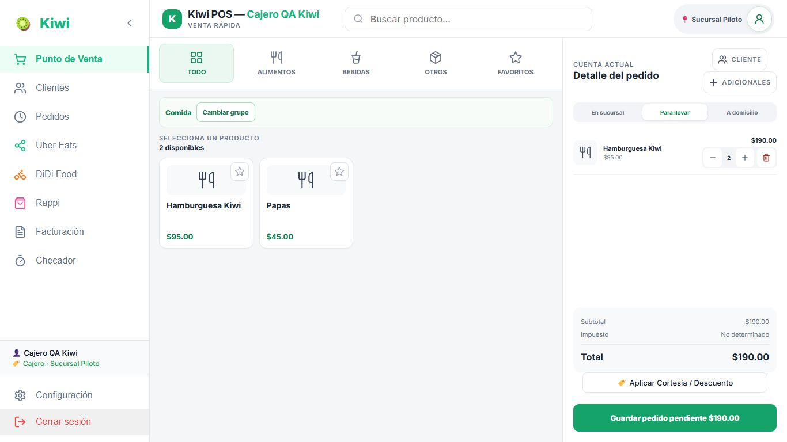
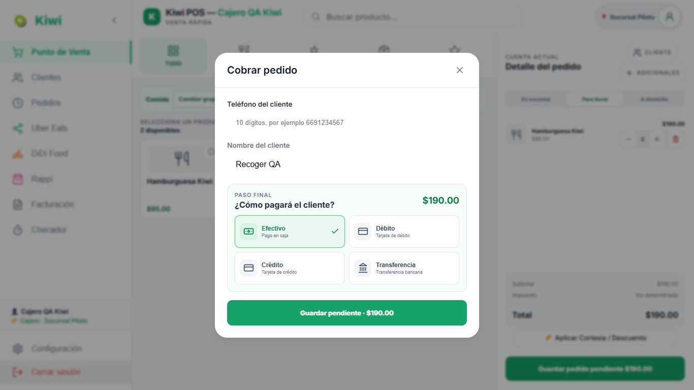

**E06/E07/E08 — Mismo folio, enmienda y pago:**

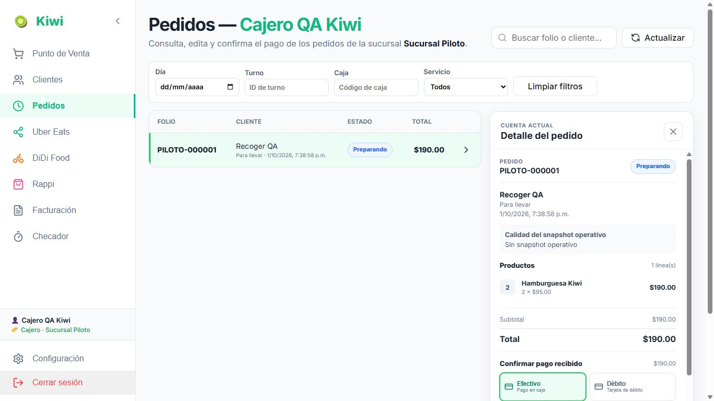
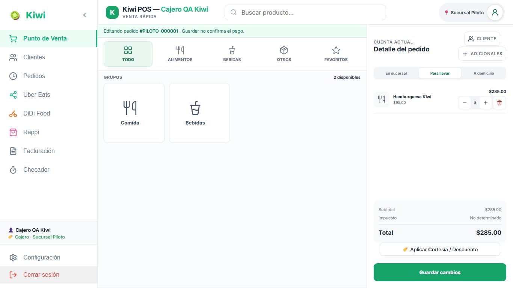
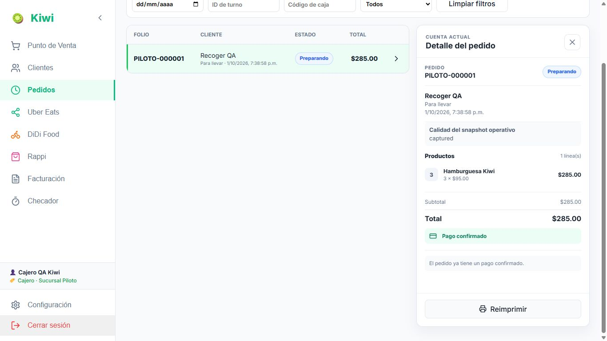

**E09/E10/E11/E12 — Cliente, domicilio, pedido y pago:**

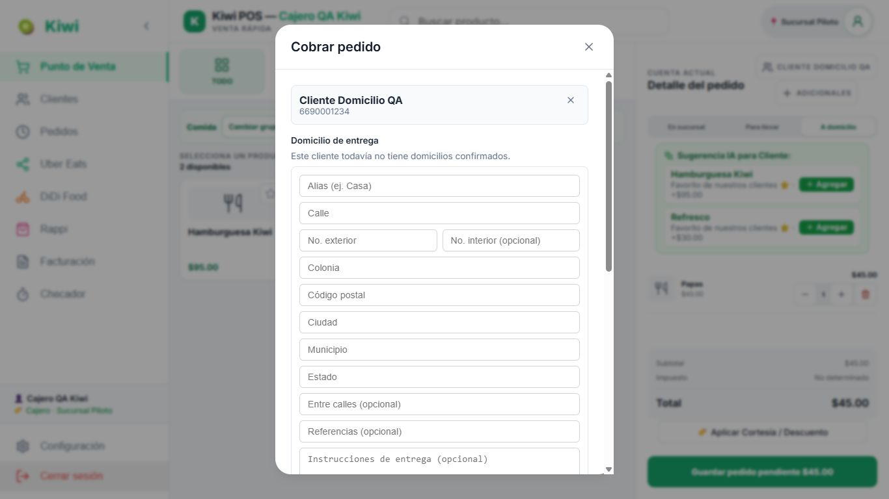
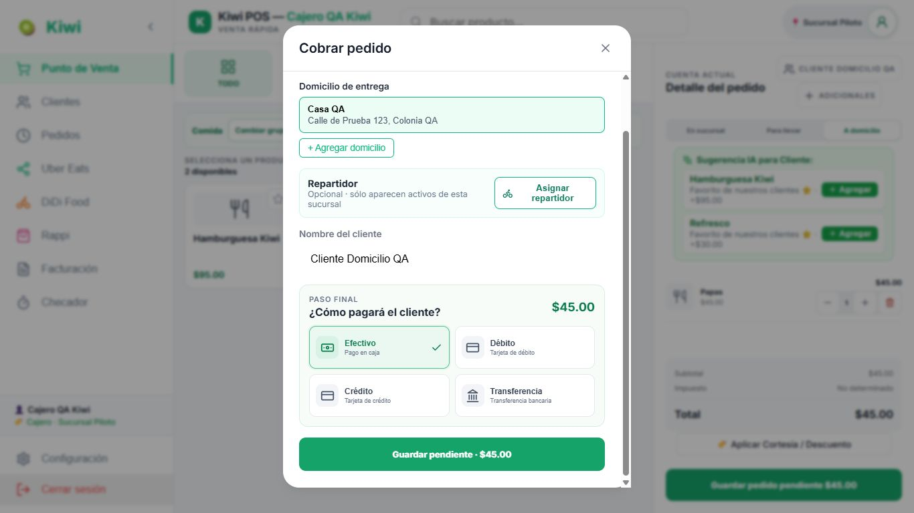
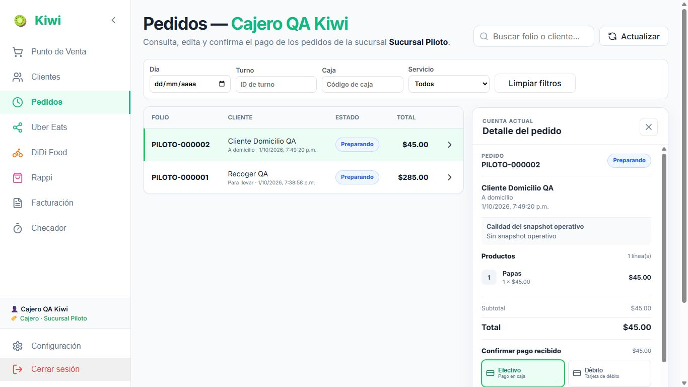
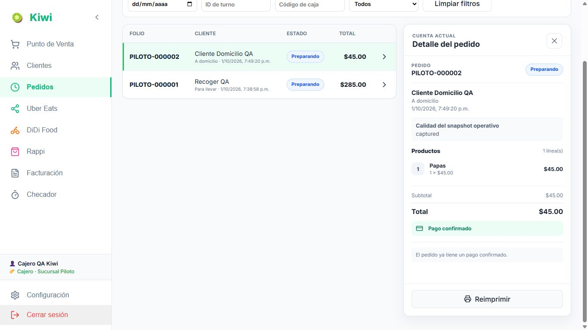

**E13/E14/E15/E17 — Complementos, precio, borrador y repetición:**

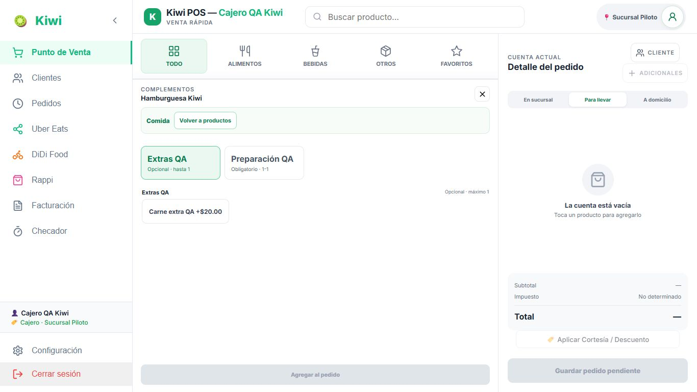
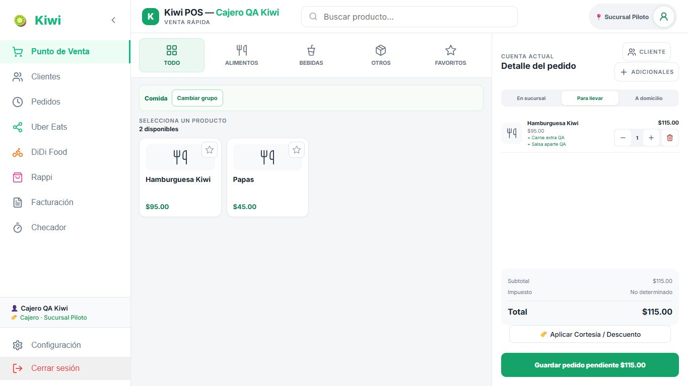
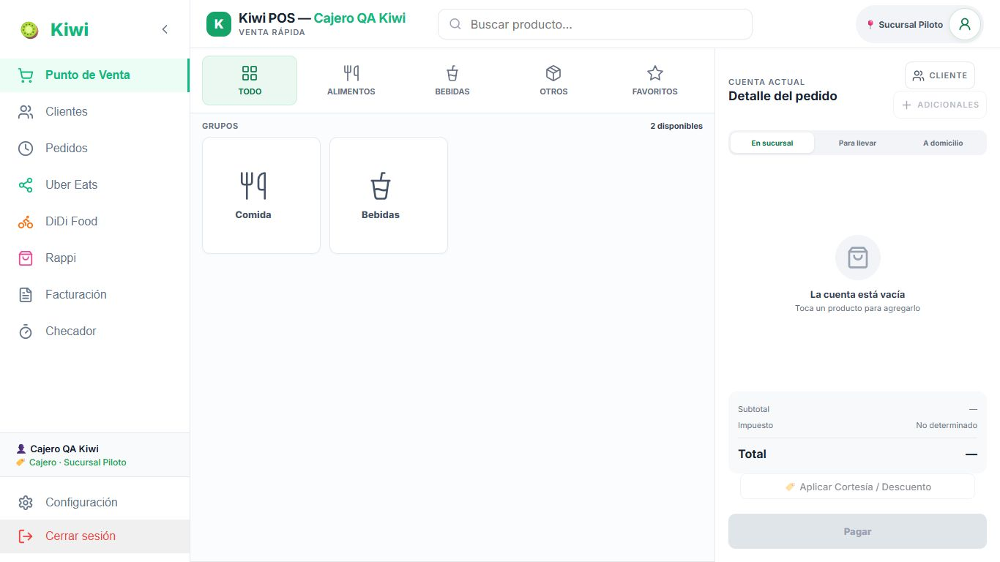
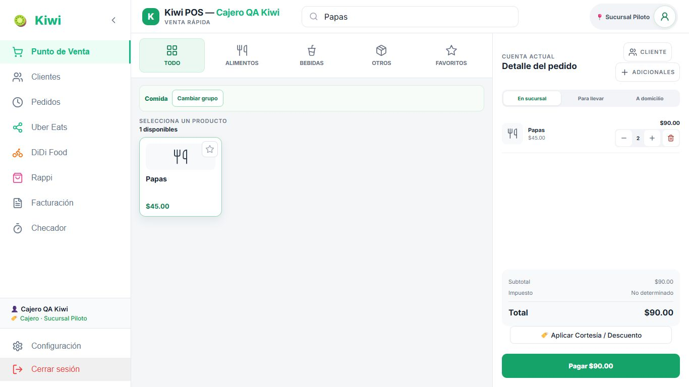

**SR10 — Cuenta, categorías y controles; [10:36](https://www.youtube.com/watch?v=Yqfn2Wuv2Co&t=636s):**

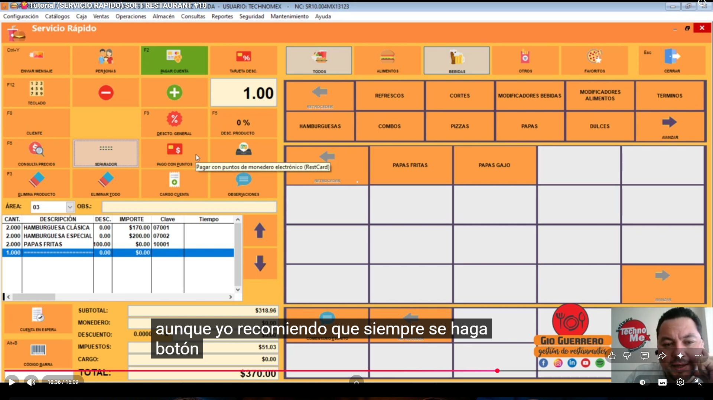

**PRO9.5 — Domicilio; [3:28](https://www.youtube.com/watch?v=LNtg70gaKD0&t=208s):**

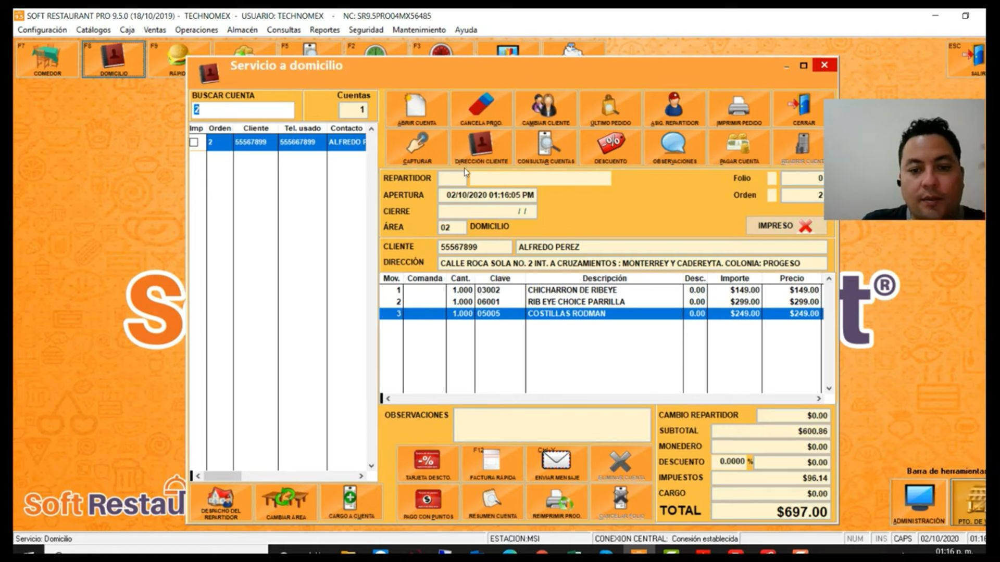

**PRO9.5 — Pago con recibido/cambio; [9:23](https://www.youtube.com/watch?v=LNtg70gaKD0&t=563s):**

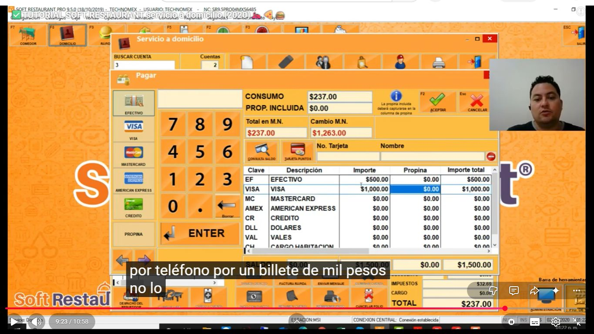

La demostración de pago muestra varios medios; no se propone introducir pagos mixtos en Kiwi
a partir de ese ejemplo. No se reprodujeron cálculos erróneos de la transcripción automática.

## Evidencia y límites de cierre

Se comprobó en navegador: recoger, cliente nuevo con domicilio, edición previa al pago,
confirmación de ambos pagos, búsqueda en categoría, repetición de producto simple, retirada del
carrito, bloqueo de modificador obligatorio, precio de extra e instrucción, y pérdida del carrito
al salir. API: dos folios, un pago por folio; recoger versión 2, domicilio versión 1; ambos
ACCEPTED con tareas activas PENDING. Domicilio y teléfonos persistidos en snapshots, aliases del
detalle vacíos. Cajero sin orders.cancel ni orders.fulfill, según permisos reales de la fixture.
Se conserva un [resumen sanitizado de la API local](POS-CAJERO-001-assets/local-api-evidence.json)
con los estados, versiones, pagos, tareas y permisos; no contiene credenciales ni contactos.

No se ejecutaron cancelaciones, preparación, reparto ni entrega como Cajero, ni se certificó
impresión física. No se inyectaron fallos de red ni se probó la recuperación offline. No se
atribuyen garantías de no duplicación frente a esos fallos a un recorrido de éxito.

No hubo cambios de código, PRD, SDD, BDD, TDD ni matriz. La revisión aplicable a este R0 es
integridad de documentos/enlaces/capturas y `git diff --check`; no se ejecutó una suite de runtime
por documentar un diagnóstico. No se realizó commit, push, despliegue o migración productiva.
